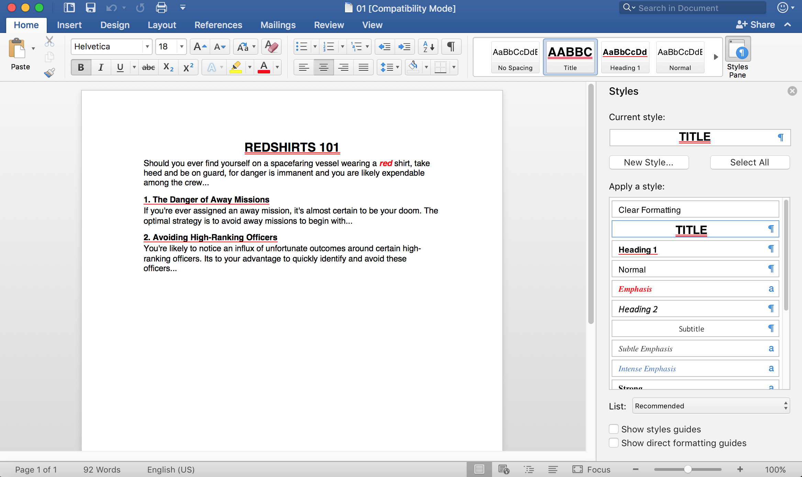

# RRTF: Ruby Rich-Text-Format Document Generator

RRTF enables programatic creation of Rich Text Format (RTF) documents in Ruby, focusing on simplifying RTF document assembly and generating clean RTF source code. This gem is founded on the [ifad-rtf gem](https://github.com/clbustos/rtf), but differs in several respects:

- The syntax for creating documents and styles is simpler.
- Paragraph styles can take on character formatting attributes (in accord to the RTF specification).
- Document stylesheets can be defined, enabling the end user to easily modify the look larger RTF documents.

The gem was created with reference to the [Microsoft Office RTF Specification (v1.9.1)](https://www.microsoft.com/en-us/download/details.aspx?id=10725).

## Installation

Add this line to your application's Gemfile:

```ruby
gem 'rrtf'
```

And then execute:

    $ bundle

Or install it yourself as:

    $ gem install rrtf

## Usage

Define the paragraph and character styles your document is to leverage in
a hashmap array or JSON file:

```json
[
  {
    "type": "paragraph",
    "id": "TITLE",
    "name": "Title",
    "primary": true,
    "auto_update": true,
    "next_style": "BODY",
    "base_style": "BODY",
    "justification": "CENTER",
    "space_after": 100,
    "bold": true,
    "underline": "DOUBLE",
    "underline_color": "#ff0000",
    "uppercase": true,
    "font_size": 36
  },
  {
    "type": "paragraph",
    "id": "H1",
    "name": "Heading 1",
    "primary": true,
    "next_style": "BODY",
    "space_after": 40,
    "space_before": 200,
    "underline": "SINGLE",
    "underline_color": "#ff0000",
    "bold": true,
    "font_size": 24
  },
  {
    "type": "paragraph",
    "id": "BODY",
    "name": "Normal",
    "primary": true,
    "default": true,
    "justification": "LEFT",
    "font_size": 24,
    "hyphenate": true
  },
  {
    "type": "character",
    "id": "EMPH",
    "name": "Emphasis",
    "additive": true,
    "italic": true,
    "bold": true,
    "foreground_color": "#ff0000",
    "locked": true
  }
]
```

(Note that font size is given in _half points_ and spacing in _twentieth points_, or "twips" using the somewhat disagreeable abbreviation, in accord with the RTF specification.)

Create a RTF document object using the settings needed for your document, then build your document and save it in an RTF file:

```ruby
require 'rrtf'
require 'JSON'

raw_styles = JSON.parse File.read('styles.json')

rtf = RRTF::Document.new("stylesheet" => raw_styles)
styles = rtf.stylesheet.styles

rtf.paragraph(styles['TITLE']) << "RedShirts 101"
rtf.paragraph(styles['BODY']) do |p|
  p << "Should you ever find yourself on a spacefaring vessel wearing a"
  p.apply(styles['EMPH']) << " red "
  p << "shirt, take heed and be on guard, for danger is immanent and you are "
  p << "likely expendable among the crew..."
end
rtf.paragraph(styles['H1']) << "1. The Danger of Away Missions"
rtf.paragraph(styles['BODY']) do |p|
  p << "If you're ever assigned an away mission, it's almost certain to be your doom. "
  p << "The optimal strategy is to avoid away missions to begin with..."
end
rtf.paragraph(styles['H1']) << "2. Avoiding High-Ranking Officers"
rtf.paragraph(styles['BODY']) do |p|
  p << "You're likely to notice an influx of unfortunate outcomes around "
  p << "certain high-ranking officers. Its to your advantage to quickly identify and "
  p << "avoid these officers..."
end
```



## Development

After checking out the repo, run `bin/setup` to install dependencies. Then, run `rake spec` to run the tests. You can also run `bin/console` for an interactive prompt that will allow you to experiment.

To install this gem onto your local machine, run `bundle exec rake install`. To release a new version, update the version number in `version.rb`, and then run `bundle exec rake release`, which will create a git tag for the version, push git commits and tags, and push the `.gem` file to [rubygems.org](https://rubygems.org).

## Contributing

Bug reports and pull requests are welcome on GitHub at https://github.com/whileman133/rrtf.


## License

Just like ifad-rtf, this gem is available as open source under the terms of the [MIT License](http://opensource.org/licenses/MIT).
